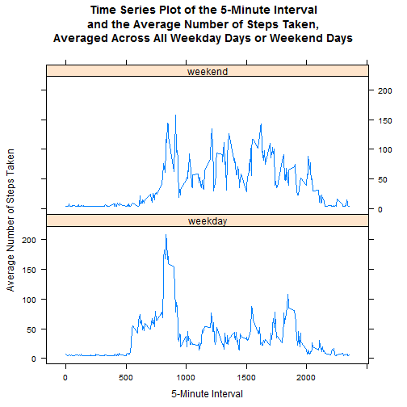

```r
library(ggplot2)
```
## Loading and preprocessing the data
#### 1. Load the data (i.e. read.csv())

```r
if (!file.exists("./data/activity.csv"))
{
  unzip("./data/activity.zip", exdir = "./data")
}

activity_data <- read.csv("./data/activity.csv", stringsAsFactors=FALSE)
```
#### 2. Process/transform the data (if necessary) into a format suitable for your analysis


## What is mean total number of steps taken per day?


#### Compute the total number of steps each day (NA values removed)

```r
steps_data <- aggregate(activity_data$steps, by=list(activity_data$date), FUN=sum, na.rm=TRUE)
```

#### Rename the attributes

```r
names(steps_data) <- c("date", "total")
```

### Compute the histogram of the total number of steps each day

```r
hist(steps_data$total, 
     breaks=seq(from=0, to=30000, by=2500),
     col="green", 
     xlab="Total Number Of Steps", 
     ylim=c(0, 25), 
     main="Histogram plot of the total number of steps taken per day")
```

 

###The mean and median are computed like

```r
mean(steps_data$total)
```

```
## [1] 9354.23
```

```r
median(steps_data$total)
```

```
## [1] 10395
```


##What is the average daily activity pattern?


#### Compute the means of steps accross all days for each interval

```r
mean_activity_data <- aggregate(activity_data$steps, 
                                by=list(activity_data$interval), 
                                FUN=mean, 
                                na.rm=TRUE)
```
#### Rename the attributes

```r
names(mean_activity_data) <- c("interval", "mean")
```

#### The time serie plot is created by the following lines of code

### Compute the time series plot

```r
plot(mean_activity_data$interval, 
     mean_activity_data$mean, 
     type="l", 
     col="blue", 
     lwd=2, 
     xlab="Interval [minutes]", 
     ylab="Average number of steps", 
     main="Time-series of the average number of steps per intervals\n(NA removed)")
```

 

## Which 5-minute interval, on average across all the days in the dataset, contains the maximum number of steps?

#### Find the position of the maximum mean

```r
max_pos <- which(mean_activity_data$mean == max(mean_activity_data$mean))
```
### Find the value of 5-minute interval at this position (column 1)

```r
print(max_interval <- mean_activity_data[max_pos, 1])
```

```
## [1] 835
```

### The 5-minute interval that contains the maximum of steps, on average across all days, is 835.


## Inputing the missing values

#####Note that there are a number of days/intervals where there are missing values (coded as NA). The presence of missing days may introduce bias into some calculations or summaries of the data.

###Calculate and report the total number of missing values in the dataset (i.e. the total number of rows with NA's)


##### TRUE boolean value is equivalent to 1 and a FALSE to 0.


```r
NA_Count <- nrow(activity_data[is.na(activity_data$steps),])
```

###The number of NA's is 2304.

## Devise a strategy for filling in all of the missing values in the dataset. The strategy does not need to be sophisticated. For example, you could use the mean/median for that day, or the mean for that 5-minute interval, etc.


#### Find the NA positions

```r
na_pos <- which(is.na(activity_data$steps))
```
#### Create a vector of means

```r
mean_vector <- rep(mean(activity_data$steps, na.rm=TRUE), times=length(na_pos))
```
####Using the strategy to remplace each NA value by the mean of the steps attribute.

####Creating a new dataset that is equal to the original dataset but with the missing data filled in.

#### Replace the NAs by the means

```r
activity_data[na_pos, "steps"] <- mean_vector
```


## Make a histogram of the total number of steps taken each day and calculate and report the mean and median total number of steps taken per day. Do these values differ from the estimates from the first part of the assignment? What is the impact of imputing missing data on the estimates of the total daily number of steps?

#### Compute the total number of steps each day (NA values removed)

```r
steps_data <- aggregate(activity_data$steps, by=list(activity_data$date), FUN=sum)
```

#### Rename the attributes

```r
names(steps_data) <- c("date", "total")
```

### Compute the histogram of the total number of steps each day

```r
hist(steps_data$total, 
     breaks=seq(from=0, to=30000, by=2500),
     col="purple", 
     xlab="Total number of steps", 
     ylim=c(0, 30), 
     main="Histogram of the total number of steps taken each day\n(NA replaced by mean value)")
```

 

### The mean and median are computed like

```r
mean(steps_data$total)
```

```
## [1] 10766.19
```

```r
median(steps_data$total)
```

```
## [1] 10766.19
```
###These formulas gives a mean and median of 10766 and 10766 respectively.


##Are there differences in activity patterns between weekdays and weekends?

### 1. Create a new factor variable in the dataset with two levels - "weekdays" and "weekend" indicating whether a given date is a weekday or weekend day.


#### create new data frame

```r
processed_activity_data <- activity_data
```

#### set up logical/test vector

```r
weekend <- weekdays(as.Date(processed_activity_data$date)) %in% c("Saturday", "Sunday")
```

#### Fill in weekday column

```r
processed_activity_data$daytype <- "weekday"
```

#### replace "weekday" with "weekend" where day == Sat/Sun

```r
processed_activity_data$daytype[weekend == TRUE] <- "weekend"
```

#### convert new character column to factor

```r
processed_activity_data$daytype <- as.factor(processed_activity_data$daytype)
```

#### Check out new data frame

```r
str(processed_activity_data)
```

```
## 'data.frame':	17568 obs. of  4 variables:
##  $ steps   : num  37.4 37.4 37.4 37.4 37.4 ...
##  $ date    : chr  "2012-10-01" "2012-10-01" "2012-10-01" "2012-10-01" ...
##  $ interval: int  0 5 10 15 20 25 30 35 40 45 ...
##  $ daytype : Factor w/ 2 levels "weekday","weekend": 1 1 1 1 1 1 1 1 1 1 ...
```

```r
head(processed_activity_data,5)
```

```
##     steps       date interval daytype
## 1 37.3826 2012-10-01        0 weekday
## 2 37.3826 2012-10-01        5 weekday
## 3 37.3826 2012-10-01       10 weekday
## 4 37.3826 2012-10-01       15 weekday
## 5 37.3826 2012-10-01       20 weekday
```


### 2. Make a panel plot containing a time series plot (i.e. type = "l") of the 5- minute interval (x-axis) and the average number of steps taken, averaged across all weekday days or weekend days (y-axis).

```r
library(lattice)
```

#### the average number of steps taken, averaged across all days for each 5-minute
#### interval

```r
newinterval <- aggregate(steps ~ interval + daytype, processed_activity_data, mean)
```

#### add descriptive variable names

```r
names(newinterval)[3] <- "mean_steps"
```

#### check out new data frame

```r
head(newinterval, 5)
```

```
##   interval daytype mean_steps
## 1        0 weekday   7.006569
## 2        5 weekday   5.384347
## 3       10 weekday   5.139902
## 4       15 weekday   5.162124
## 5       20 weekday   5.073235
```

### plot time series

```r
library(lattice)
xyplot(
  mean_steps ~ interval | daytype,
  newinterval,
  type = "l",
  layout = c(1,2),
  main = "Time Series Plot of the 5-Minute Interval\nand the Average Number of Steps Taken,\nAveraged Across All Weekday Days or Weekend Days",
  xlab = "5-Minute Interval",
  ylab = "Average Number of Steps Taken"
)
```

 


##### Note that the `echo = FALSE` parameter was added to the code chunk to prevent printing of the R code that generated the plot.
